# 多用户图片社交程序
特殊数据库关系，用户注册，权限管理，高级数据库查询，全文搜索， 实时推送等。

# 项目组织架构
三种常见的项目组合架构：
- 功能式架构 （BlueLog）
    - 由各个代表程序组件的子包组成，比如蓝本(blueprints)，表单(forms)，模板(templates)，模型(models)
    - 功能清晰，利于开发维护，每个模块下可以创建子包
        
        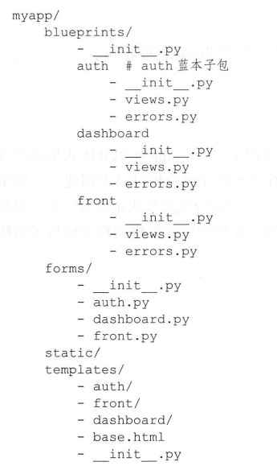
        
        - 使用这种方式构造子蓝本模块
        
            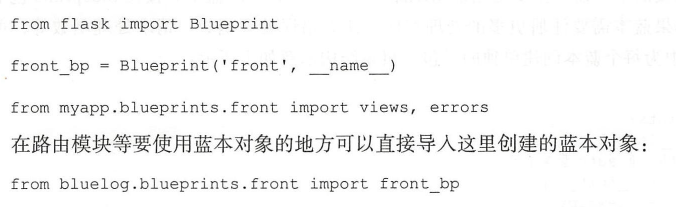
        
- 分区式架构
    - 程序按照自己的板块分成不同的子包，比如可以分为front,auth,dashboard三个子包，这种分类决定了每一个子包对应
      着一个蓝本
        
        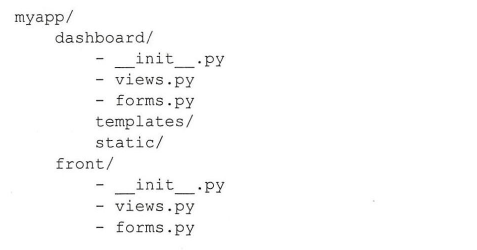
        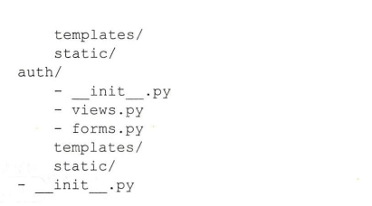

- 混合式架构
    - 功能按分区式架构，但是template,static 又是在公共下面
        
        

## 如何选择

- 功能式组织方式：**各个功能之间联系较为紧密**
- 分区式：**比较大的项目，功能偏多**，比如程序本身，后台管理，公司博客，API文档

按照功能主要分为三部分，为每个部分创建一个蓝本：
- 前台页面Front
- 认证auth
- 后台管理dashboard

# 编写程序骨架

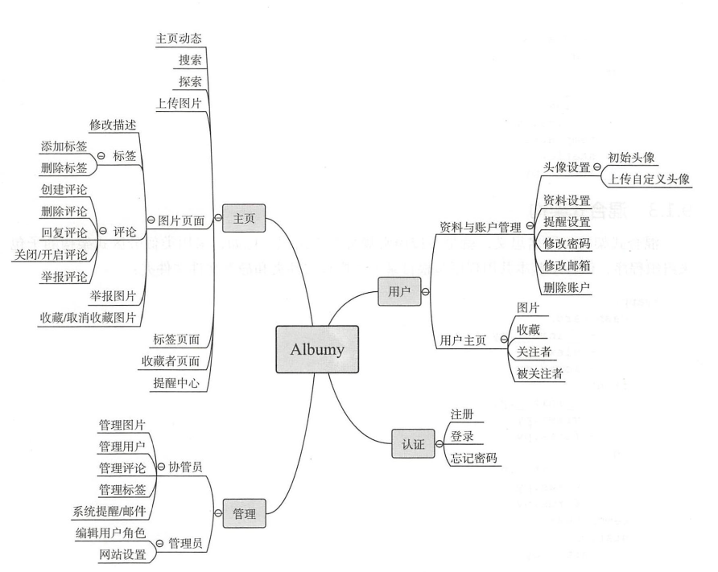

主要包含四个部分：认证系统(auth)，主要功能(main)，用户系统(user)，管理系统(admin),采用功能式架构。为了便于组织
AJAX请求的视图函数，还创建了一个ajax模块。

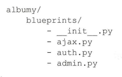
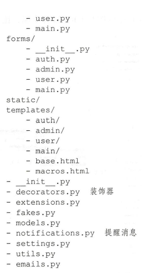

## 数据库模型图
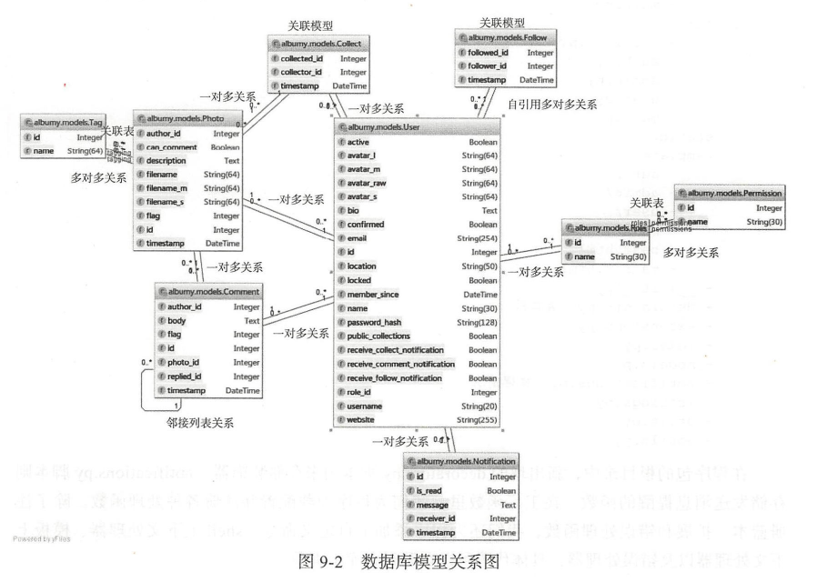

## Forge 图片数据随机生成
```python
the_destination_path = "/picture"
import random
from PIL import Image
r = lambda: random.randint(128,255)
img = Image.new(mode='RGB',size=(800,800),color=(r(),r(),r()))
img.save(the_destination_path)
```
# 高级用户认证
- 账号注册功能，填写注册信息，接收验证邮箱，通过单击验证链接来确认账号等。（基于Flask-Login）
- 账号重置密码
- 账号重置邮箱
- 账号认证，重新认证

# 优化文件上传
多文件上传时，用户需要感知上传进度。而JavaScript实现的客户端实时显示文件上传状态，
而且这些JavaScript上传库还提供了文件的客户端验证功能。

常用的JavaScript文件上传库有
- JQuery File Upload
- Dropzone.js
- Plupload等

而扩展Flask-Dropzone集成了Dropzone.js 简化了大部分设置

## Flask-Dropzone
### 配置参数
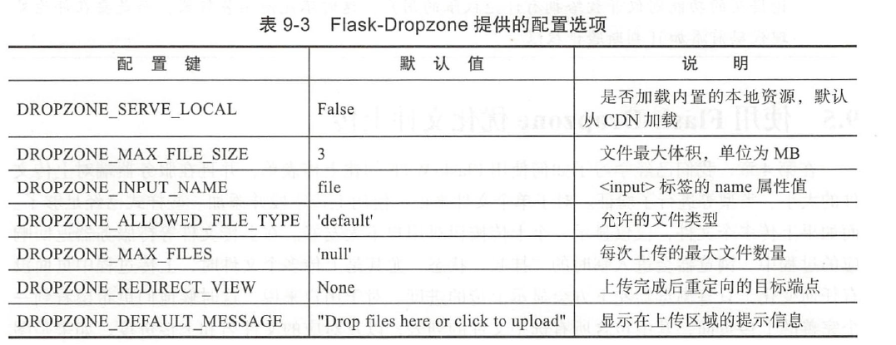

### 文件类型配置值
MIME类型以及后缀名判断文件类型
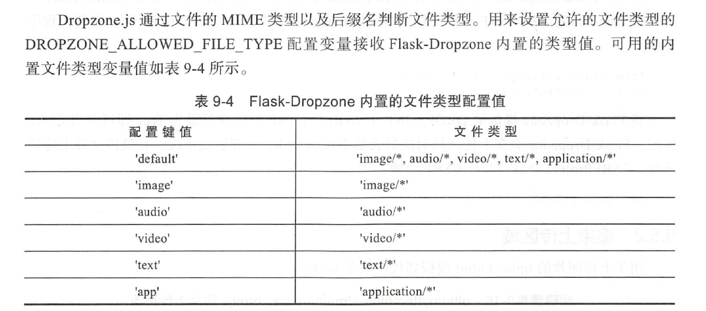

### 错误处理
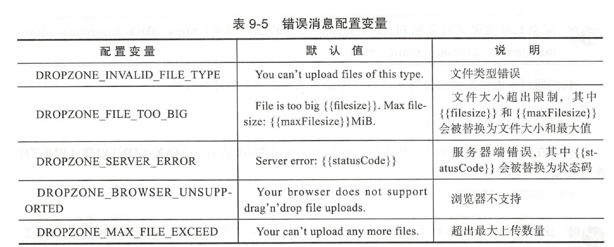

### CSRF保护


### 导入依赖，创建html
dropzone.load_css()
dropzone.load_js()
dropzone.style()
dropzone.create()


创建视图函数 : /upload
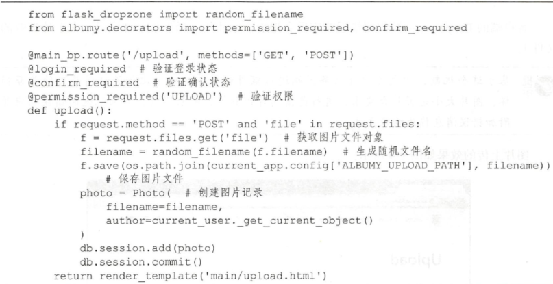

增加图片裁剪的功能，提高小图片（small）和中等图片(medium) 的功能

# 用户弹窗 AJAX实现
1. 使用AJAX请求获取用户的资料，两个点：（1）弹窗的触发方式 （2）弹窗中用户资料数据的获取方式
    - JS中，监听鼠标悬停事件（hover）并显示弹窗并不复杂。
    - 如何获取用户的数据？？？：如果写在HTML模板这样带来和删除确认模拟框同样的问题，当有多个用户头像也就加载了大量
    并不需要加载的HTML代码。**所以更合理的方案是采用AJAX技术来动态获取数据，悬停事件触发AJAX获取后台数据**
    


# 插件依赖库
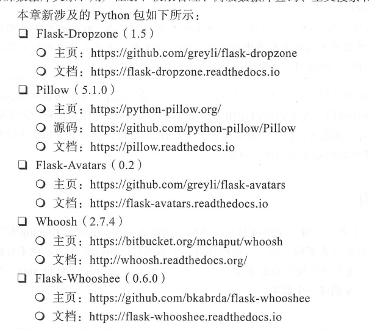


