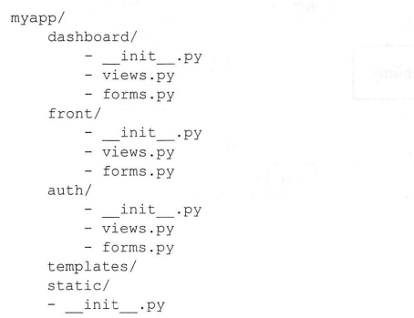
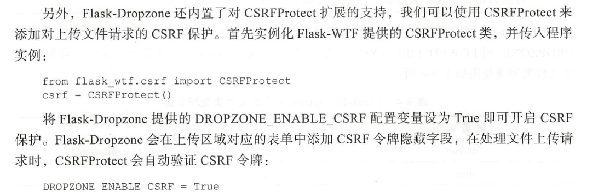

# 多用户图片社交程序
特殊数据库关系，用户注册，权限管理，高级数据库查询，全文搜索， 实时推送等。

# 项目组织架构
三种常见的项目组合架构：
- 功能式架构 （BlueLog）
    - 由各个代表程序组件的子包组成，比如蓝本(blueprints)，表单(forms)，模板(templates)，模型(models)
    - 功能清晰，利于开发维护，每个模块下可以创建子包
        
        
        
        - 使用这种方式构造子蓝本模块
        
            
        
- 分区式架构
    - 程序按照自己的板块分成不同的子包，比如可以分为front,auth,dashboard三个子包，这种分类决定了每一个子包对应
      着一个蓝本
        
        
        

- 混合式架构
    - 功能按分区式架构，但是template,static 又是在公共下面
        
        

## 如何选择

- 功能式组织方式：**各个功能之间联系较为紧密**
- 分区式：**比较大的项目，功能偏多**，比如程序本身，后台管理，公司博客，API文档

按照功能主要分为三部分，为每个部分创建一个蓝本：
- 前台页面Front
- 认证auth
- 后台管理dashboard

# 编写程序骨架


主要包含四个部分：认证系统(auth)，主要功能(main)，用户系统(user)，管理系统(admin),采用功能式架构。为了便于组织
AJAX请求的视图函数，还创建了一个ajax模块。


## 数据库模型图


## Forge 图片数据随机生成
```python
the_destination_path = "/picture"
import random
from PIL import Image
r = lambda: random.randint(128,255)
img = Image.new(mode='RGB',size=(800,800),color=(r(),r(),r()))
img.save(the_destination_path)
```
# 高级用户认证
- 账号注册功能，填写注册信息，接收验证邮箱，通过单击验证链接来确认账号等。（基于Flask-Login）
- 账号重置密码
- 账号重置邮箱
- 账号认证，重新认证

# 优化文件上传
多文件上传时，用户需要感知上传进度。而JavaScript实现的客户端实时显示文件上传状态，
而且这些JavaScript上传库还提供了文件的客户端验证功能。

常用的JavaScript文件上传库有
- JQuery File Upload
- Dropzone.js
- Plupload等

而扩展Flask-Dropzone集成了Dropzone.js 简化了大部分设置

## Flask-Dropzone
### 配置参数


### 文件类型配置值
MIME类型以及后缀名判断文件类型


### 错误处理


### CSRF保护


### 导入依赖，创建html
dropzone.load_css()
dropzone.load_js()
dropzone.style()
dropzone.create()


创建视图函数 : /upload


增加图片裁剪的功能，提高小图片（small）和中等图片(medium) 的功能

# 用户弹窗 AJAX实现
1. 使用AJAX请求获取用户的资料，两个点：（1）弹窗的触发方式 （2）弹窗中用户资料数据的获取方式
    - JS中，监听鼠标悬停事件（hover）并显示弹窗并不复杂。
    - 如何获取用户的数据？？？：如果写在HTML模板这样带来和删除确认模拟框同样的问题，当有多个用户头像也就加载了大量
    并不需要加载的HTML代码。**所以更合理的方案是采用AJAX技术来动态获取数据，悬停事件触发AJAX获取后台数据**
2. 显示和隐藏弹窗，利用jQuery提供的hover()方法来创建监听事件

# 推送消息
三种场景的推送
1. 新的关注者
2. 图片有新的评论/回复
3. 图片被收藏

几种解决方案：
1. 简单的AJAX轮询查询
2. 使用Server-sent Events(SSE, 服务器推送事件) 实现真正的服务器推送，Flask-SSE
3. 使用更完善和强大的双向通信协议WebSocket来实现实时更新

# 用户更改自己的设置（需求留着）

# 首先和探索 
## 获取正在关注用户的图片
1. 获取用户关注的所有用户
2. 获取每个用户的图片
3. 将所有用户的图片汇总到一起
4. 使用时间降序排列图片
5. 对图片进行分页处理

# Flask-Whooshee实现全文搜索
## 原理
全文搜索原理是索引程序通过扫描数据库中的每一个词，对每一个词建立一个索引，指明该词在数据库中出现的次数和位置，
当用户查询时，检索程序通过索引进行查找，并返回匹配的数据。

## 读写频繁的程序，自动更新应该关闭
使用定时任务工具来周期性手动调用whooshee.index()方法以更新搜索引擎的索引文件

## 定时任务的选择
1. Celery
2. APScheduler

# 集成单元测试
TDD （Test-Driven Development）先编写对应的测试，接着编写代码，不断完善代码直至通过测试为止。

这种方法简化了开发的过程，因为它遵循KISS（Keep It Simple，Stupid）和 YAGNI （You Aren't Gonna Need It）原则，不过产生多余的代码和程序功能

## 自动化测试分三种

1. 单元测试(Unit Test)：单独的代码块，比如函数进行测试
2. 集成测试(Integration Test): 集成测试对代码单位之间的协同工作进行测试，比如测试Flask 和 各个Flask扩展的集成代码。在部署到云平台时，集成测试可以确保
程序和云平台接口正常协作。
3. 用户界面内测试(User Interface Test): 端对端测试或全链路测试，适合用来测试复杂的页面交互。比如包含JavaScript代码和AJAX请求等实现的功能

## flask_client
```python
# 创建测试客户端对象
from wsgi import app
client = app.test_client() 
response = client.get('/')
response.get_data()
response.status_code
response.status

# follow_redirects 跟随重定向
client.post('/',data={"key":"value","key2":"value2"}, follow_redirects=True)

```

## unittest 写测试用户
1. 测试用例(Test Case) 最小的测试单元被称为测试用例，继承unittest.TestCase的类表示
2. 测试固件(Test Fixture) 执行测试前期准备工作Setup()和后期清理工作tearDown()。setUpClass()和tearDownClass()
需要classmethod装饰器
3. 测试集(Test Suite) 用来聚合所有测试以便执行
4. 测试运行器(Test Runner) 测试运行器用来运行测试，收集测试结果，并呈现给用户。

## coverage 检查测试用例的代码覆盖率
通过unittest写好测试用例后，通过coverage来汇报测试用例是否覆盖了全部的代码函数
```shell script
# 第一种方式直接写
coverage run --source=albumy --branch -m unittest discover

# 第二种方式创建.coverage文件来保存配置
coverage run -m unittest discover
```
此时测试用例跑完，会生成一个覆盖率统计结果文件.coverage。有了覆盖率统计结果的文件后，只需要再运行report命令，就可以看到统计的结果了
```shell script
coverage report
coverage html
```
## Flask8检查代码的质量问题
帮助检测代码是否符合PEP 8规范，是否包含语法错误或未使用的变量和导入，另外还可以检查代码复杂度


# 性能优化
- 函数执行
- 数据库查询
- 模板渲染
- 页面资源加载

## 函数性能分析
使用profiler库来分析整个代码库哪些函数运行最慢，可以使用异步队列任务把它们放到后台处理，避免阻塞请求响应的处理

好用的任务队列推荐：
- Celery
- Redis-Queue

## 数据库查询
1. 发现慢查询：数据库查询如果超过1s的时间，则记录进日志中去。SQLALCHEMY_RECORD_QUERIES = True, 阈值设置为1s 。

    

2. 解决: 增加索引，优化数据库查询语句，表结构三个方向进行优化。还有一个就是设置缓存

### Flask-Caching 
#### 设置缓存


利用装饰器对视图函数设置缓存，timeout为过期时间，不同页面设置不同的缓存时间，如下可以设置缓存：
网站介绍页面，隐私政策页面等不常变动的页面

缓存的key需要唯一：
- 被缓存的数据会以键值对的形式存储起来，当下次处理请求时会先查找是否存在对应键的数据，**所以要确保键值的唯一性**

如果路由带了可变参数，需要每一个参数都设立缓存
- 

缓存非视图函数，需要手动设置缓存键 key_prefix='add'
- 

对于接收参数的函数和方法，如果你想将参数纳入缓存考虑范围，使用memoize()装饰器

#### 更新缓存
如果对页面内容进行了修改调用 cache.delete()方法来清除缓存，传入特定的键来获取对应的缓存


cache.clear() 清除所有缓存

cache.memoized() 删除缓存

#### redis 作为后端


## Flask-Assets 优化静态资源
每一个HTML页面，会触发大量的JS文件和CSS文件，部署时我们一般采用租用CDN服务
或是用设立独立的静态资源服务器的方式进行优化
- 对CSS和JS文件进行压缩，去除换行，空白和注释，提高资源请求效率
- 分别合并多个CSS文件和JS文件，减少页面加载的请求数

而Webassets提供了Web项目的资源管理功能
1. 注册资源集合
    
    

2. 生成资源文件
3. 在模板中加载资源集


### Vue.js
这里就会发现，不如用Vue.js专门开发前端内容，后端采用Flask-RESTFUL API 


# 使用Nginx
1. 提高处理静态文件的效率。Nginx处理静态文件的速度非常快，而且可以对静态文件设置缓存
2. 提高安全系数。使用它避免直接暴露WSGI服务器，而且可以作为防火墙来抵御网络攻击
3. 提高程序处理能力。设置反向代理可以缓冲请求，对请求进行预处理，交给WSGI服务器一个完整的HTTP请求。设置负载均衡，优化请求处理效率


# 插件依赖库


